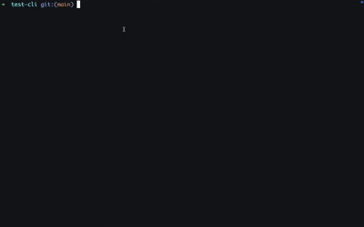
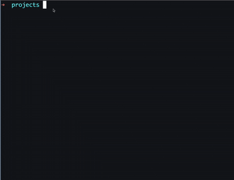

# 🛠️ bami-cli

**bami-cli** is a powerful developer automation tool designed to scaffold and supercharge your backend projects. Whether you're working with PostgreSQL, Ley, MongoDB, Mongoose, or other tools in the future — `bami-cli` helps you get started instantly, with best practices baked in.

> ⚡️Bami automates your chores—so you don’t have to!

---

## 🚀 Quick Start

### Install Globally

Pick your preferred package manager:

```bash
npm install -g bami-cli
# or
yarn global add bami-cli
# or
pnpm add -g bami-cli
```

Or run directly with:

```bash
npx bami-cli init
```

---

## 📦 What You Get

- 📁 Clean project folder structure
- 🔐 Environment file templates
- 📦 Pre-configured `.gitignore`
- 🧠 Ley config and migrations setup
- 🐘 PostgreSQL-ready scaffolding
- 🧰 Utility helpers
- ✨ Future support for MongoDB, Prisma, Redis, Kafka, and more

---

## 📝 Usage

```bash
bami init
```

This command:

- Checks your current directory for conflicts
- Detects your current package manager
- Installs relevant dependencies
- Generates `.env`, `.env.example`, `.gitignore`, and config files
- Scaffolds folders like `database/`, `util/`, and `ley.config.js`
- Sets you up for PostgreSQL with ley migrations by default (extensible)
- Sets up migration script for Ley

---

## 📁 Sample Generated Structure

```bash
my-app/
├── database/
│   └── migrations/
├── util/
│   └── config.js
├── env.txt
├── env.example.txt
├── ley.config.js
└── .gitignore
```

---

## 🧰 Features

- ✅ Ley migration setup
- ✅ PostgreSQL scaffold
- ✅ `.env` and `.gitignore` handling
- ✅ templates
  - ✅ PostgreSQL connection
  - ✅ Ley config
- 🛠 Monorepo support (coming soon)
- 🛠 MongoDB and Mongoose support (coming soon)
- 🛠 Prisma integration (planned)
- 🛠 Redis/Kafka templates (future roadmap)

---

## 🧪 Testing

`bami-cli` uses [Vitest](https://vitest.dev) for testing.

Run tests with:

```bash
pnpm test
```

---

## 🗺 Roadmap

- [x] PostgreSQL + Ley support
- [ ] Monorepo support
- [ ] MongoDB + Mongoose
- [ ] Prisma ORM integration
- [ ] Redis, Kafka, and other service templates
- [ ] Customizable project presets
- [ ] Plugin support
- [ ] VSCode extensions and dev container setup
- [ ] Cloud-ready deployment templates

---

## 🙌 Contributing

We welcome contributions of all kinds!

### Getting Started

```bash
git clone https://github.com/Eprince-hub/bami-cli
cd bami-cli
pnpm install
```

### Project Structure

```bash
bami-cli/
├── src/                         # Main source code for CLI
│   ├── commands/                # CLI command definitions
│   │   ├── init.ts              # Logic for `bami init`
│   │   └── local/               # Local/internal-only commands (e.g. create-template)
│   │       └── createTemplate.ts
│   ├── steps/                   # Step-by-step logic modules for operations
│   ├── templates/               # Template files copied into new projects
│   └── index.ts                 # CLI entry point
├── utils/                       # Shared utility functions (e.g., file ops, logging)
├── tests/                       # Vitest test files (unit + integration)
├── package.json                 # Project metadata and CLI config
├── tsconfig.json                # TypeScript compiler configuration
├── tsup.config.ts              # TSUP build configuration
└── README.md                    # Project documentation
```

### Development Scripts

```bash
pnpm build     # Bundle CLI with tsup
pnpm link      # Link local CLI for testing
pnpm test      # Run tests with Vitest
pnpm lint      # Run ESLint
```

> Please see `CONTRIBUTING.md` (coming soon) for style guides and PR process.

---

## ❓ FAQ

### Can I run `bami-cli` in any folder?

✅ Yes. It uses the current working directory to scaffold. No need to be inside a special repo.

---

### Will it overwrite my files?

🛑 No. It checks for conflicts before writing. Future versions will include prompts or flags for force-overwrite.

---

### What if `.env` or `.gitignore` already exist?

- `.env` will be updated to include the needed env variables, if it exists, it's skipped
- `.gitignore` will be updated to include missing entries (not overwritten)

---

### What if I want to customize templates?

You can fork the repo and change the contents of `src/templates/` to suit your team’s setup.

---

## 💡 Philosophy

The idea behind `bami-cli` is to **eliminate repetitive tasks** during development and help teams standardize the start of their backend projects and optimize repeating tasks — with the flexibility to scale up into full enterprise scaffolding.

90% of the project i do uses PostgreSQL and Ley and setting up the same boilerplate over and over is a waste of time. `bami-cli` aims to automate that, while also being extensible for future needs.

> It’s not just a CLI tool, it’s a **developer experience enhancer**.

- With `bami-cli`

  - ✅ One command
  - ✅ Instant project setup
  - ✅ No more boilerplate copy-pasting
  - ✅ Focus on building features, not setup
    

- Without `bami-cli`

  - ❌ Manual setup for every project
  - ❌ Copy-pasting boilerplate code
  - ❌ Repetitive tasks
  - ❌ Error-prone configurations

- `bami-cli` is safe to run

  - It runs only if it needs to

    

## 🤝 Support

If you have any questions, issues, or feature requests, please open an issue on [GitHub](https://github.com/Eprince-hub/bami-cli/issues)

---

## ⭐️ Star and Share

If you find this useful, please consider [starring the repo](https://github.com/Eprince-hub/bami-cli) and sharing it with your team.

---

## 📜 License

MIT © [Victor Ejike](https://github.com/Eprince-hub)
